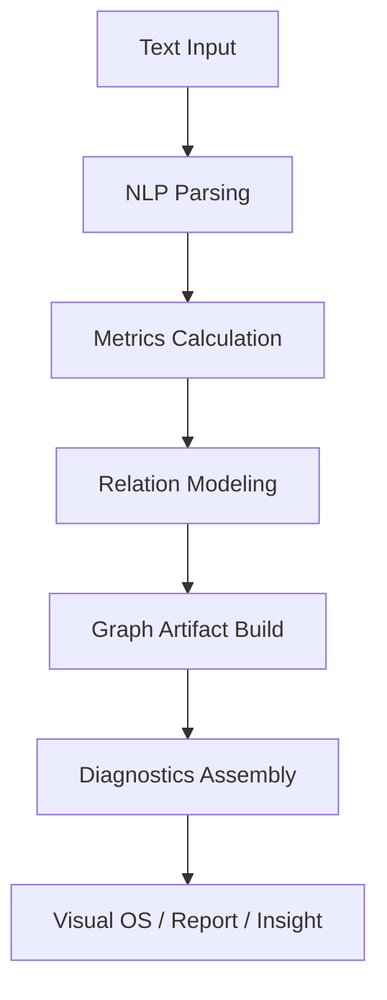

# Analysis Engine Architecture

## 摘要（中文）

本节为英文摘要导读，便于国际协作与检索。

## Executive Summary (EN)

This document defines the modular analysis engine architecture for NarrativeOS.

## Machine-readable Metadata | 机读元数据

```yaml
doc_id: architecture-analysis-engine-README
path: architecture/analysis-engine/README.md
lang_primary: zh-CN
lang_secondary: en
audience: [architect, developer, ai-agent]
agent_ready: true
source_of_truth: narrative-docs
```

## 术语入口

首次阅读本页时，建议先对照 [术语表](../../assets/glossary.zh-en.md)。

本页高频术语包括：诊断信号、证据回链、契约输出、Run Profiles、Full MRI。

## 定位 | Positioning

Analysis Engine 是 NarrativeOS 的核心计算中枢，负责将文本输入转化为可观测、可解释、可行动的诊断结果。

架构采用模块化设计，不使用单一大模型作为唯一分析路径。

## 目标与非目标

### 目标

- 在统一契约下输出可解释诊断信号
- 支持按场景组合当前基线引擎（默认六引擎），形成可控分析成本
- 为 Visual OS、Report、Insight 提供稳定上游数据

### 非目标

- 不承担直接文本生成代写
- 不在引擎层直接耦合 UI 展现逻辑
- 不允许绕过统一输出契约返回私有格式

## 设计原则 | Design Principles

- 模块化：按分析职能拆分为独立引擎，支持分步演进与替换
- 可解释：每个引擎输出可追溯指标与中间结果
- 可组合：支持按场景选择引擎组合，形成差异化分析流水线
- 可扩展：通过标准输入输出协议接入新模型与新算法

## 引擎集合架构（当前基线：六引擎）

说明：六引擎是当前版本的默认基线配置，后续可按产品阶段进行扩展或收敛。

### Engine 1: 字符与词汇引擎（Lexical DNA Engine）

职责：构建语言基础画像。

核心输出：

- 字频
- 词频
- 词性分布
- TTR（词汇丰富度）
- Zipf 分布
- 高频词异常

建议工具链：spaCy、jieba/pkuseg、HanLP。

### Engine 2: 句法与节奏引擎（Syntax & Rhythm Engine）

职责：构建句法复杂度与节奏结构画像。

核心输出：

- 句长分布与方差
- 节奏波形
- 从句深度
- 平均依存距离
- 复杂句比例
- Sentence ECG（句长心电图）

建议能力：dependency parsing、constituency parsing。

建议工具链：HanLP、Stanford NLP。

### Engine 3: 语义网络引擎（Semantic Network Engine）

职责：构建语义空间关系与主题聚类结构。

核心输出：

- 词语距离
- 段落相似度
- 主题簇
- 语义重叠
- Semantic Galaxy（语义星系图）

建议嵌入模型：BGE、Sentence-BERT、text-embedding-3。

### Engine 4: 叙事流分析引擎（Narrative Flow Engine）

职责：识别主题迁移路径与篇章脉络。

核心输出：

- 主题分段
- 主题迁移链路
- 主题流图（Topic Flow Map）

建议算法：BERTopic、LDA、TextTiling、Transformer Topic Model。

### Engine 5: 修辞与风格引擎（Rhetoric & Style Engine）

职责：识别修辞结构与风格特征，构建作者声纹。

核心输出：

- 修辞模式识别（排比、对偶、比喻、重复）
- AI 模板句检测与 AI 热区标注
- Style Fingerprint（风格指纹）
- 风格向量（空间感、抽象度、感官密度、叙事速度、解释倾向）
- 作者声纹（Author Voiceprint）

### Engine 6: 情绪与感官引擎（Emotion & Sensory Engine）

职责：构建多维情绪与感官表达画像。

核心输出：

- 多维情绪状态（如怀旧、克制、昂扬、疏离）
- 感官词识别（风、光、气味、触感等）
- Sensory Density（感官密度）

建议能力：情绪分类、感官词典匹配、上下文强度加权。

建议工具链：情绪分类模型 + 规则词典融合管线。

## 输入契约（建议基线）

```yaml
document_id: doc-001
lang: zh-CN
content:
  title: 文档标题
  text: 正文全文
options:
  engines: [lexical, syntax_rhythm, semantic, narrative_flow, rhetoric_style, emotion_sensory]
  profile: fast_scan | full_mri
  evidence_level: basic | strict
context:
  workspace_id: ws-001
  project_id: prj-001
```

约束：

- `document_id` 必填
- `content.text` 不能为空
- `engines` 为空时默认启用全引擎

## 输出契约（建议基线）

每个引擎输出遵循统一结构：

- `metrics`: 量化指标
- `signals`: 结构信号
- `artifacts`: 可视化构件
- `diagnostics`: 诊断结论
- `confidence`: 置信度

示例：

```json
{
  "document_id": "doc-001",
  "profile": "full_mri",
  "engines": {
    "syntax_rhythm": {
      "metrics": {
        "avg_sentence_length": 31.2,
        "long_sentence_ratio": 0.43
      },
      "signals": [
        "rhythm_flat_zone"
      ],
      "artifacts": {
        "rhythm_timeline": "artifact://rhythm/doc-001"
      },
      "diagnostics": [
        {
          "id": "diag-rhythm-01",
          "summary": "长句连续堆叠导致阅读疲劳",
          "evidence": ["sentence:12", "sentence:13", "sentence:14"]
        }
      ],
      "confidence": 0.87
    }
  }
}
```

## 标准处理流程

```text
文本输入
  ↓
NLP 解析
  ↓
指标计算
  ↓
关系建模
  ↓
图谱生成
  ↓
诊断报告
```

该流程采用 CT 扫描式分层分析：逐层成像、逐层解释、逐层生成可行动诊断结论。



## 端到端 Full MRI Walkthrough（单文）

下面用一个最小但完整的单文案例说明“请求如何穿过当前基线引擎集合并形成可回链诊断”。

### Step 1: 提交请求

输入一个长文本并指定 `full_mri`，启用严格证据级别：

```yaml
document_id: novel-ch01-v3
lang: zh-CN
options:
  profile: full_mri
  evidence_level: strict
  engines: [lexical, syntax_rhythm, semantic, narrative_flow, rhetoric_style, emotion_sensory]
```

### Step 2: 解析与引擎执行

- 上游解析器先生成 token、句法树、段落边界与主题候选
- 当前基线引擎按契约并行或分阶段执行
- 若某引擎不能给出结论，必须返回 skip reason，而不是静默缺失

### Step 3: 证据装配

- 融合器汇总各引擎 `metrics` 与 `signals`
- 每条诊断至少绑定 1 处可定位 evidence（sentence / segment / relation）
- `artifacts` 写入统一路径，供 Visual OS 和报告层复用

### Step 4: 输出与复核

一个可接受的输出至少满足：

- 当前基线引擎均有结果或显式跳过原因
- 所有 `diagnostics` 含 evidence 定位
- `confidence` 落在 [0,1]
- 同一 `document_id` 的 artifacts 与 diagnostics 版本一致

若该输出将进入正式研究任务而不只是产品界面展示，还应补充：

- 对应 study template
- 对应标注协议或规则来源
- 对应最小复现包

研究型基线见： [../../whitepaper/research-methodology-and-reproducibility.md](../../whitepaper/research-methodology-and-reproducibility.md)

相关样板：

- [../../whitepaper/study-template-v2-corpus-comparative-analysis.md](../../whitepaper/study-template-v2-corpus-comparative-analysis.md)
- [../../whitepaper/annotation-protocol-narrative-segmentation.md](../../whitepaper/annotation-protocol-narrative-segmentation.md)
- [../../whitepaper/reproducibility-package-evidence-traceability.md](../../whitepaper/reproducibility-package-evidence-traceability.md)

### Step 5: 典型诊断示例

当 Engine 2 与 Engine 4 同时发现问题时，可能得到类似结论：

- 诊断：中段节奏压平，主题迁移缺少缓冲段
- 证据：`sentence:112-128` 与 `segment:5`
- 建议动作：拆分长句簇，并在段间插入过渡语义节点

这类输出的关键不在“建议是否华丽”，而在“证据是否可回链、可复核、可对比版本变化”。

## 运行剖面（Run Profiles）

### Fast Scan

- 目标：秒级到分钟级快速筛查
- 默认引擎：Engine 1 + Engine 2 + Engine 5
- 输出：关键风险提示与优先修订建议

### Full MRI

- 目标：深度诊断与结构证据链
- 默认引擎：当前基线六引擎全开（可按版本扩展或收敛）
- 输出：可追溯诊断报告与可视化工件

### Adaptive Routing & Incremental Reuse

- 默认执行策略：优先 Fast Scan，仅在风险信号触发时升级 Full MRI。
- 增量执行策略：采用 dirty-region reuse，避免每次变更触发全文重算。
- 复用执行策略：采用 parse-once/fan-out-many，将高开销解析产物复用到多个引擎。
- 资源执行策略：当资源不足时优先返回受限结果与 skip reason，而不是静默超时。
- 工件执行策略：高成本中间结果通过 artifact handle 引用复用，降低重复装配成本。

## 依赖与边界

- 输入来源：Input/Language Layer
- 输出去向：Visual OS、Insight Engine、Report 导出
- 边界要求：跨运行时通信仅通过契约，不允许引擎直接依赖 UI 实现

## 与系统架构的映射关系

- 输入层：文本接入与格式标准化
- 语言计算层：词法/句法/语义基础解析
- 分析引擎层：当前基线引擎集合并行或串行执行
- 可视化/报告层：星系图、流图、心电图与诊断报告输出

## 验收场景（最小集）

### 场景 1：单文 Fast Scan

- 输入：1000-5000 字中文文本
- 期望：返回至少 3 条结构诊断信号
- 验证：每条诊断至少 1 处 evidence 定位

### 场景 2：单文 Full MRI

- 输入：长文本（>10000 字）
- 期望：当前基线引擎均返回结果或显式跳过原因
- 验证：输出契约字段完整，confidence 在 [0,1]

### 场景 3：异常输入

- 输入：空文本或非法字符集
- 期望：返回标准错误对象，不返回空壳诊断
- 验证：错误码与 request_id 可追踪

## 常见问题排查 | Troubleshooting

### 现象 1：Engine 结果缺失

- 检查 `options.engines` 是否误过滤
- 检查上游语言解析是否失败
- 检查该引擎是否返回了 skip reason

### 现象 2：有结论但无证据

- 检查 evidence_level 是否为 `strict`
- 检查诊断构造阶段是否丢失 sentence id
- 检查 artifacts 与 diagnostics 是否同版本

### 现象 3：不同引擎结论冲突

- 检查输入文本版本号是否一致
- 检查多引擎并行执行是否使用同一 tokenizer 配置
- 检查融合器权重是否使用默认基线

更多问题见 [../../troubleshooting.md](../../troubleshooting.md)。

## 校对能力补齐扩展（零规则库起步）

为补齐校对类能力但保持可解释性，本架构采用“规则优先、模型增强”的扩展路线。

该扩展默认按平台域并入执行：

- Engine 7/8 提供分析能力，不直接形成独立产品域。
- 发现入口由 Text Lab 承接，解释与建议由 Insight Engine 承接。
- 规则与词条沉淀由 Knowledge Graph（产品层 Library）承接。
- 误报/漏报趋势由 Corpus Observatory 承接。

### 扩展引擎候选

- Engine 7（候选）：Proofreading Engine（基础校对）
- Engine 8（候选）：Consistency & Reference Engine（一致性与引用校对）

说明：候选引擎不改变当前基线六引擎默认执行路径；仅在 profile 或策略命中时启用。

补充说明：候选引擎输出必须遵守平台域责任边界，禁止在分析层直接闭环发布结论。

### Engine 7 输入输出契约（建议）

输入最小字段：

```yaml
document_id: doc-001
text: <content>
mode: proofreading
rule_bundle: seed | learned | hybrid
```

输出最小字段：

```yaml
proofreading:
  metrics:
    typo_recall: 0.0-1.0
    punctuation_precision: 0.0-1.0
    grammar_warning_count: int
  diagnostics:
    - id: prf-001
      error_type: typo | punctuation | grammar | format | numbering
      span_ref: sentence:12
      suggestion: <fix-text>
      evidence: [rule:RGX-001, context:span-12]
      confidence: 0.0-1.0
```

### Engine 8 输入输出契约（建议）

输入最小字段：

```yaml
document_id: doc-001
text: <content>
mode: consistency
reference_scope: intra_doc | corpus
```

输出最小字段：

```yaml
consistency:
  metrics:
    entity_consistency_rate: 0.0-1.0
    reference_alignment_rate: 0.0-1.0
    duplication_alert_count: int
  diagnostics:
    - id: cns-001
      conflict_type: term_inconsistency | citation_mismatch | numbering_chain_break
      span_refs: [p03-s01, p17-s02]
      suggestion: <normalize-or-fix>
      evidence: [entity:XXX, rule:CNS-002]
      confidence: 0.0-1.0
```

### 零规则库自学习生命周期

规则生命周期：

```text
candidate
  -> shadow_eval
  -> gated_release
  -> active
  -> deprecated
```

约束：

- 规则从 candidate 到 active 必须经过 Golden Set 回归。
- 误报率超阈值的 active 规则必须自动回滚到上一个稳定版本。
- 任何规则命中输出必须带 rule_id 与 evidence，禁止黑箱结论。
