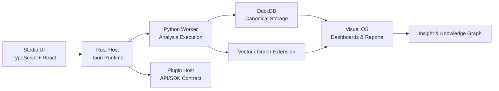
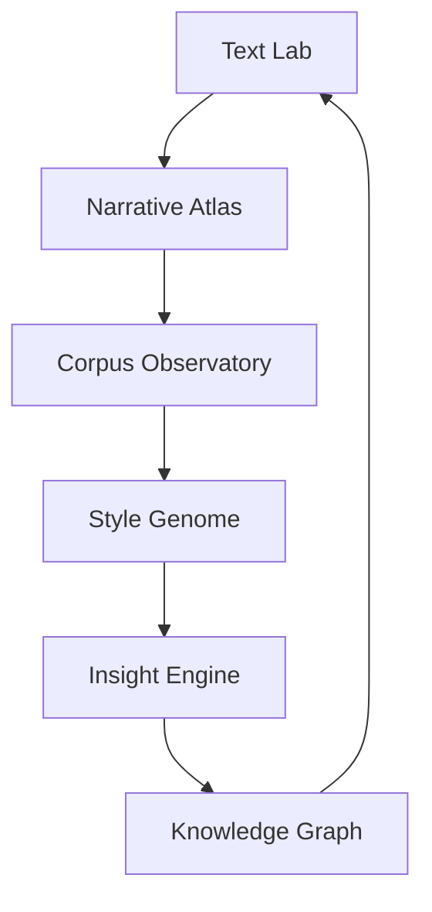

# System Architecture

## 摘要（中文）

本节为英文摘要导读，便于国际协作与检索。

## Executive Summary (EN)

This document defines the end-to-end system architecture, platform loop, and core engine interactions of NarrativeOS.

## Machine-readable Metadata | 机读元数据

```yaml
doc_id: architecture-system-README
path: architecture/system/README.md
lang_primary: zh-CN
lang_secondary: en
audience: [developer, architect, ai-agent]
agent_ready: true
source_of_truth: narrative-docs
```

## 术语入口

首次阅读本页时，建议先对照 [术语表](../../assets/glossary.zh-en.md)。

本页高频术语包括：运行时隔离、契约（Contract）、引擎集合（当前基线六引擎）、主链路、可追溯证据。

## 系统定位

NarrativeOS 是多仓库、多语言系统，核心由以下能力组成：

- Rust + Tauri: Host 与桌面能力编排
- TypeScript + React: 交互层与应用界面
- Python Worker: 分析与计算任务执行
- DuckDB + GIS: 数据与空间分析基础设施

## 架构原则

- 运行时隔离是强约束
- 跨运行时交互优先走显式协议（IPC / API Contract）
- 存储层以 DuckDB 为标准基线
- 插件通过稳定 API/SDK 边界扩展，不绕过核心约束

## 系统全景图



该图用于快速回答三个问题：

- 谁负责交互编排（Studio + Rust Host）
- 谁负责计算执行（Python Worker）
- 结果如何沉淀并回到可解释界面（DuckDB/扩展 -> Visual OS）

## 平台化架构定位

NarrativeOS 采用平台级产品架构，不以单次文本分析作为终点，而以持续能力进化作为系统目标。

平台主闭环定义为：

```text
文本输入
	↓
分析计算
	↓
数据沉淀
	↓
知识统计
	↓
模型进化
	↓
新分析能力
```

该闭环确保系统从“分析工具”演化为“语言观测基础设施”。

详细定义见： [../platform/README.md](../platform/README.md)

## 分析系统分层

在 NarrativeOS 中，文本分析能力采用四层分工：

```text
输入层
	↓
语言计算层
	↓
分析引擎层
	↓
可视化/报告层
```

- 输入层：文本接入、清洗与格式标准化
- 语言计算层：分词、词性、句法、语义、篇章解析
- 分析引擎层：按职能拆分为独立引擎集合（当前基线六个）
- 可视化/报告层：输出图谱与可解释诊断报告

## 核心分析引擎（当前基线：六引擎）

- Engine 1 字符与词汇引擎：词汇 DNA、TTR、Zipf 与高频词异常
- Engine 2 句法与节奏引擎：句长分布、从句深度、依存距离与 Sentence ECG
- Engine 3 语义网络引擎：Embedding 空间、主题簇与 Semantic Galaxy
- Engine 4 叙事流引擎：Topic Segmentation 与主题迁移路径建模
- Engine 5 修辞与风格引擎：Style Fingerprint、AI 热区与作者声纹
- Engine 6 情绪与感官引擎：多维情绪状态与 Sensory Density

详细定义见： [../analysis-engine/README.md](../analysis-engine/README.md)

## Visual OS 子系统

Visual OS 是可视化/报告层的核心子系统，采用语言驾驶舱形态组织分析结果。

核心界面包括：

- 总览仪表盘（Overview Dashboard）
- 语言地图（Language Terrain Map）
- 语义星系（Semantic Galaxy）
- 节奏时间轴（Rhythm Timeline）
- AI 热区（AI Heat Zones）

子系统职责：

- 将多引擎诊断结果映射为统一视觉语义
- 提供缩放、钻取、联动等交互能力
- 提供问题优先级与可行动诊断入口

详细定义见： [../visual-os/README.md](../visual-os/README.md)

## 端到端分析流程

```text
文本输入
	↓
NLP 解析
	↓
指标计算
	↓
关系建模
	↓
图谱生成
	↓
诊断报告
```

该流程采用 CT 扫描式分层分析，保证每个阶段结果可追溯、可解释、可复核。

## 平台域主链路（当前基线：六域）

```text
Text Lab
	↓
Narrative Atlas
	↓
Corpus Observatory
	↓
Style Genome
	↓
Insight Engine
	↓
Knowledge Graph
```

该主链路定义了平台级能力协同关系与演进方向。



回环关系表示系统不是“一次分析后结束”，而是会把知识沉淀反哺到后续分析能力。

## CTO 实施蓝图（收敛到 system）

为减少文档分裂，CTO 蓝图的工程实现部分统一维护在本节。

### 1) Studio Layer

定位：语言 IDE，而非离线分析页面。

双轨实施：

- V1：LibreOffice Extension（UNO API + Python/JS bridge）
- V2+：Narrative Studio（Tauri + Rust + React）

Studio 组件：Editor Core、Narrative Sidebar、Atlas Renderer、Plugin Host、Local Engine。

### 2) Local Engine Layer

原则：任何影响写作流的能力必须本地完成。

本地运行时建议拆分：

- Parser Service：生成 DocumentTree / ParagraphTree / SentenceTree
- Metrics Service：dirty region recompute 增量计算句长、节奏、词频等
- Style Detector：规则 + 轻模型识别模板句、修辞、重复结构
- Cache：热区缓存与短周期状态
- Event Bus：事件驱动解耦（ParseUpdated -> MetricsUpdated -> SidebarRefresh）
- Incremental Efficiency：仅重算受影响节点，解析产物通过 Event Bus 扇出复用。

### 3) Plugin System

插件分层：Core / Community / Enterprise。

统一插件契约：

- analyze()
- visualize()
- report()

每个插件必须声明输入 Schema、输出 Schema 与资源需求，确保 Atlas 与报表自动兼容。

### 4) Cloud Intelligence

云端职责：异步重分析与协同，不承载实时反馈。

建议结构：

- API Gateway（FastAPI + gRPC）
- Access Boundary（接入边界校验，用户系统由外部环境承接）
- Task Queue
- Model Router
- Data Services（Object / Vector / Graph / Analytics）

范围排除说明：

- 本项目架构不包含内建用户系统（账号、登录、注册、租户管理）。
- 如需身份认证与权限控制，默认由部署环境或外围平台系统提供。

### 5) Task System

任务分级：

- Fast Queue（秒级）：摘要、风格、小图谱
- Deep Queue（分钟级）：全文 MRI、Narrative Flow
- Corpus Queue（小时级）：万级语料聚类与研究任务

调度约束：

- 通过队列高低水位实现背压，过载时优先保障 Fast Queue。
- Deep Queue 仅承接异步深度任务，不进入同步写作反馈环。
- Corpus Queue 默认批量限流，避免挤占交互路径资源。

演进建议：Redis + Celery 起步，规模阶段升级 Kafka。

### 6) Model Router

目标：模型可替换，任务自动选路。

路由层组成：Local Models / Open Models / Commercial LLMs / Tool Layer。

策略示例：词频 -> 规则；节奏 -> 本地模型；深度解释 -> LLM；Corpus -> Embedding Pipeline。

选路约束：

- 实时任务优先本地路径，减少网络抖动对交互时延的影响。
- 深度任务默认异步云端路径，并与 Task System 的队列水位联动。
- 当资源或时延预算不足时，自动回退到受限路径并保留可追踪原因。

### 7) Language Data Layer

四库分工：

- Object Store：原文与衍生对象
- Vector DB：embedding、style vector、theme vector
- Graph DB：作者、作品、主题、概念、修辞关系
- Analytics DB：频率、趋势、指标统计

### 8) Language Feature Schema

原则：所有分析输出必须落入统一 Schema，禁止私有输出格式漂移。

核心对象：Document -> Structure / Metrics / Style / Semantic / Narrative / Metadata。

该约束是插件生态可持续扩展的先决条件。

### 9) 安全与隐私

双模式：

- Local Mode：默认离线，不上传
- Cloud Mode：用户显式开启云增强

敏感场景必须支持 private workspace 与 self-host。

### 10) 演进路线（5-10 年）

- Phase 1：Studio 内实时闭环（Local-first）
- Phase 2：云端异步 MRI 与协同
- Phase 3：统一 Schema 全域落地 + 插件生态扩展
- Phase 4：万本级语料沉淀为语言知识云
- Phase 5：百万文本尺度中文语言地图与数字人文底座

### 11) 优化策略实施拆解（Host / Worker / UI）

本节把前述优化策略转换为可执行工程任务，默认按 P0/P1/P2 三个优先级推进。

| Track | Scope | Priority | Expected Gain | Acceptance Signal |
| --- | --- | --- | --- | --- |
| Host Track | 队列背压、调度限流、任务准入 | P0 | 交互稳定性提升，减少过载抖动 | Fast Queue 在高负载下仍保持可响应 |
| Worker Track | 增量重算、缓存命中、深度任务降级 | P0 | 降低重复计算与峰值内存 | dirty region 路径明显减少全文重算次数 |
| UI Track | 轻重路径提示、异步状态反馈、结果分层展示 | P1 | 用户体感提升，分钟级任务可接受 | 深度任务均显示进度/队列/完成通知 |

#### Host Track（Rust/Tauri）

| Task | Priority | Rule Mapping | Output |
| --- | --- | --- | --- |
| 实现队列水位背压控制 | P0 | Task System 调度约束 | Fast/Deep/Corpus 队列具备高低水位阈值 |
| 实现任务准入策略 | P0 | Model Router 选路约束 | 实时请求不会被误导入 Deep Queue |
| 实现过载降级回退 | P1 | 受限路径 + 可追踪原因 | 返回受限结果并附 skip/degrade reason |
| 实现任务遥测指标 | P1 | 可观测性与验收信号 | 暴露 queue_latency / queue_depth / throttle_count |

#### Worker Track（Python）

| Task | Priority | Rule Mapping | Output |
| --- | --- | --- | --- |
| 实现 dirty-region 增量重算链路 | P0 | Local Engine Incremental Efficiency | 变更只触发受影响节点重算 |
| 实现 parse-once/fan-out-many 复用 | P0 | Analysis Engine Adaptive Routing & Incremental Reuse | 解析产物可被多引擎共享 |
| 实现缓存键版本化与失效 | P1 | 统一缓存体系 + content_hash/engine_version | 缓存误命中率可控 |
| 实现 artifact handle 产物复用 | P1 | 缓存复用约束 | 大对象通过 artifact:// 引用访问 |

#### UI Track（TypeScript/React）

| Task | Priority | Rule Mapping | Output |
| --- | --- | --- | --- |
| 实现轻重路径状态可视化 | P1 | Fast Scan / Full MRI 运行剖面 | 用户可见当前路径与任务类型 |
| 实现异步任务反馈闭环 | P1 | Task System 背压与异步约束 | 展示排队中/运行中/已完成/降级 |
| 实现分层结果展示 | P2 | 默认轻量结果 + 深度补充结果 | 首屏优先展示 Fast Scan 结果 |
| 实现失败原因透出 | P2 | skip reason / degrade reason | 用户可见为什么未触发 Full MRI |

#### 联调顺序建议

1. 先打通 Host 背压 + Worker 增量重算，确保系统在负载下不退化。
2. 再接入 artifact handle 复用，降低深度链路重复计算成本。
3. 最后完善 UI 分层反馈，提升用户对异步深度任务的接受度。

## Language Feature Schema 2.0（收敛到 system）

Language Feature Schema 2.0 是 NarrativeOS 的语言数据宪法层。

该层一旦设计失误，未来会触发系统级重构。因此其优先级高于具体模型、UI 与单个分析插件。

### 设计目标

Schema 必须同时服务：

- 实时写作
- 深度 MRI
- 跨文本比较
- 插件扩展
- 语料统计
- AI 解释
- 长期演化

### 核心原则：Everything Is Observable

NarrativeOS 将文本视为 Language Objects，而非字符串。

示例：一句话在系统内部是 SentenceObject，且附带结构、节奏、情绪、语义、修辞、来源信息。

这保证 Atlas、Insight 与插件能够共享同一可观察对象语义。

### 五层语言对象系统

```text
Document Layer
	↓
Structure Layer
	↓
Feature Layer
	↓
Semantic Layer
	↓
Knowledge Layer
```

### 顶层对象骨架（六类）

```text
Document
├── Segment
├── Sentence
├── Token
├── Feature
└── Relation
```

对象定义：

- Document：论文、小说、散文、政策稿等顶级容器
- Segment：章、节、段、小节等结构节点
- Sentence：句子级节奏与功能单位
- Token：词/字符级微观对象
- Feature：统一语言特征货币
- Relation：Atlas 图关系基础边

### Document Schema（文档层）

```text
Document
├── metadata
├── structure
├── language_profile
├── vectors
└── provenance
```

字段要求：

- metadata：标题、作者、体裁、语言等基础属性
- language_profile：文档语言画像（style_cluster、abstractness、sensory_density 等）
- vectors：多向量并存（semantic/style/narrative/emotion），禁止单 embedding 覆盖全部语义
- provenance：来源与版本链（source、scan_version、created_at），确保复现性

### Structure Schema（结构层）

结构树采用对象化节点，而非纯文本块：

```text
Document
├── Chapter
├── Section
├── Paragraph
└── Sentence
```

Segment 示例字段：id、type、parent、text、cohesion、transition_score。

说明：断桥检测与结构跃迁诊断依赖该层，不应退化为纯 NLP token 流。

### Sentence Schema（句子层）

句子对象结构：

```text
Sentence
├── syntax
├── rhythm
├── rhetoric
├── semantics
└── emotion
```

关键字段：length、rhythm、syntax_depth、rhetoric[]、function。

function 语义建议统一枚举：描写、解释、论证、过渡、收束。

### Feature Schema（统一语言货币）

所有分析结果必须归一化为 Feature：

```text
Feature
├── type
├── value
├── confidence
├── scope
└── provenance
```

示例：abstractness、metaphor_density、ai_template_score 等均采用同构输出。

该约束使新插件可无缝接入 Atlas 与 Insight，无需修改可视化核心。

### Feature Taxonomy（六大类）

- Structural：cohesion、transition、hierarchy
- Rhythm：sentence_variance、breathing、cadence
- Stylistic：metaphor、parallelism、abstractness
- Semantic：topic、density、novelty
- Emotional：nostalgia、tension、distance
- Narrative：arc、shift、redundancy、bridge

说明：bridge（断桥）在 2.0 中定义为正式特征对象，不再是临时诊断标签。

### Relation Schema（关系层）

```text
Relation
├── source
├── target
├── type
└── weight
```

推荐关系类型：co_occurrence、semantic、transition、citation、reference、contrast、temporal、narrative。

该层是 Atlas 语义河流、主题迁移与关系图谱渲染的统一数据基础。

### Corpus Schema（百万文本层）

Corpus 必须对象化，不可仅用文档列表代替：

```text
Corpus
├── documents
├── distributions
├── clusters
└── trends
```

关键目标：支持同类语料统计基线，给出可验证比较结论。

示例能力：某文本抽象度高于同类均值 x%。

### Knowledge Graph Schema（语言宇宙层）

核心实体建议：Author、Work、Theme、Style、Concept、Technique、Corpus。

核心关系建议：influences、belongs_to、shares_style、uses、evolves_into。

该层在大规模语料积累后形成 Language Knowledge Cloud。

### Schema 2.0 总览

```text
Document
├── Metadata
├── Structure
│   └── Segment
├── Sentence
├── Feature
├── Relation
├── Vector
└── Provenance
				↓
Corpus
				↓
Knowledge Graph
```

实施约束：所有引擎、插件、批任务与 AI 解释输出必须兼容此总览，不得绕开统一 Schema 写入私有格式。

## Language Processing Pipeline（收敛到 system）

Language Processing Pipeline 定义 NarrativeOS 在运行时如何把 Studio、Cloud 与 Schema 串成闭环。

目标：同时支持实时写作与百万语料分析，并避免重复计算、模块耦合与数据分叉。

### 设计原则

- 单一数据真源（Single Source of Truth）
- 增量计算（Incremental）
- 事件驱动（Event-driven）
- 多级缓存
- 统一 Feature 流
- 本地优先、云端增强

### 双流水线总图

系统包含两条共享同一 Schema 的流水线：

- Live Pipeline（毫秒级）：面向 Studio 实时反馈
- Cloud MRI Pipeline（秒到分钟级）：面向深度分析与语料沉淀

```text
Studio Edit
	└─> Text Change Event
				├─> Local Live Pipeline -> Sidebar / Atlas 即时反馈
				└─> Cloud MRI Pipeline -> Deep Report / Corpus 更新
```

约束：两条流水线必须共享 Language Feature Schema 2.0，禁止本地云端各自定义私有字段。

### Live Pipeline（实时流水线）

原则：用户每次输入均不触发全文重算。

标准链路：

```text
编辑事件
	↓
Dirty Region Detection
	↓
Incremental Parse
	↓
Feature Update
	↓
Sidebar Refresh
	↓
Atlas Refresh
```

#### 1) Dirty Region Detection

基于 Document AST 的增量 diff 识别 changed_nodes，仅重算受影响节点。

#### 2) Incremental Parse

生成 Narrative Tree，而非仅句法树。

解析层建议：

- Layer 1 Lexical
- Layer 2 Syntax
- Layer 3 Discourse（transition / argument / description）

#### 3) Real-time Feature Engine

输入：AST。输出：持续更新的 Feature Stream。

```text
Feature Engine
├── Structural
├── Rhythm
├── Style
├── Emotion
└── Narrative
```

#### 4) Feature Bus

Parser 与消费端通过 Feature Bus 解耦。

消费者：Sidebar、Atlas、AI Insight、Cloud Sync。

约束：消费端只读 Feature Stream，不重复直接解析原文。

### Atlas Pipeline（地图流水线）

Atlas 是渲染器，不是分析器。

标准链路：

```text
Feature Stream
	↓
Graph Builder
	↓
Layout Engine
	↓
Renderer
```

布局建议：

- Semantic Layout（星系）
- Narrative Layout（河流）
- Structure Layout（城市）

渲染建议：WebGL（如 PixiJS / Three.js）用于大图谱高帧率交互。

### Cloud MRI Pipeline（深度流水线）

云端流水线为异步分阶段执行：

```text
Upload
	↓
Task Queue
	↓
Deep Parse
	↓
Feature Expansion
	↓
Vectorization
	↓
Graph Build
	↓
MRI Report
	↓
Corpus Update
```

阶段建议：Parse -> Feature -> Vector -> Insight -> Corpus。

约束：每阶段可独立失败重试，禁止全黑箱单任务。

### Vectorization Pipeline（多向量流水线）

NarrativeOS 采用多向量系统，不使用单 embedding 代表文本全貌。

```text
Document
├── Semantic Vector
├── Style Vector
├── Narrative Vector
└── Emotion Vector
```

编码流程：Semantic Embedding -> Style Encoding -> Narrative Encoding -> Emotion Encoding。

输出：Vector Bundle，供 Corpus 比较与 Insight 检索复用。

### Insight Pipeline（Feature RAG）

原则：AI 不得直接脱离 MRI 数据下结论。

标准链路：

```text
用户提问
	↓
Feature Query
	↓
Evidence Retrieval
	↓
Model Reasoning
	↓
Explanation
```

定位：AI 是数据解释器，不是无约束评论器。

### Corpus Pipeline（百万文本流水线）

标准链路：

```text
Corpus Import
	↓
Distributed MRI
	↓
Feature Aggregation
	↓
Cluster Analysis
	↓
Trend Detection
	↓
Knowledge Graph Update
```

分布式建议：Ray / Dask / Spark。

目标：从单文档诊断升级为宏观语言观测能力。

### 统一缓存体系（三层）

- L1 Memory Cache：本地毫秒级热数据（如当前段落）
- L2 Disk Cache：本机秒级结果（如全文 AST）
- L3 Cloud Cache：跨任务共享缓存（如 Redis）

缓存键必须版本化：doc_id + content_hash + engine_version。

缓存复用约束：

- Artifact 句柄采用 artifact://{engine}/{resource} 进行跨模块引用，避免重复传输大对象。
- 当 content_hash 或 engine_version 变化时，相关缓存必须失效并触发增量重算。

### Pipeline 生命周期闭环

```text
Studio Edit
	↓
Dirty Detect
	↓
Incremental Parse
	↓
Feature Bus
	↓
Atlas / UI
	↓
Cloud Sync
	↓
Deep MRI
	↓
Vector Bundle
	↓
Corpus
	↓
Knowledge Graph
	↓
Insight
	↓
Back to Studio
```

该闭环定义了 NarrativeOS 的统一数据生命循环。

下节进入 Language Intelligence Engine（认知架构），定义规则、统计与 LLM 的职责边界与协作机制。

## Language Intelligence Engine（收敛到 system）

Language Intelligence Engine 定义 NarrativeOS 如何形成语言判断。

目标不是“让 LLM 直接给意见”，而是构建可复现、可量化、可学习的认知系统。

### 认知原则

- 认知分层：从感知到推理逐层约束，不允许单层越权
- 证据优先：结论必须可回溯到 Feature/Pattern/Evidence
- 稳定优先：感知与模式层尽量不依赖 LLM
- 学习优先：随语料增长持续校准基线与模式库

### 五层认知系统

```text
Language Intelligence Engine
├── Layer 1 Perception
├── Layer 2 Pattern
├── Layer 3 Interpretation
├── Layer 4 Reasoning
└── Layer 5 Collective Learning
```

#### Layer 1 Perception（语言感知层）

原则：只观察，不解释。

输入：AST。输出：Feature。

该层不调用 LLM，保证稳定与低延迟。

子模块：

- Structural Sensor：层级、段落长度、过渡、断桥
- Rhythm Sensor：呼吸点、长短句分布、密度、停顿
- Semantic Sensor：主题、实体、概念
- Emotional Sensor：距离感、温度、张力

约束：感知层输出必须量化，不输出审美结论。

#### Layer 2 Pattern Engine（模式识别层）

原则：识别规律，不解释意义。

链路：Feature -> Pattern Detection -> Pattern Objects。

模式类型：

- Structural Pattern：断桥、闭环、跳跃、递进
- Stylistic Pattern：重复修辞、AI 模板、高抽象
- Narrative Pattern：铺垫、转场、疲劳、高潮
- Corpus Pattern：学科文风、时代风格、作者习惯

Pattern 作为独立对象写入系统，供 Atlas 与 Insight 直接复用。

#### Layer 3 Interpretation Engine（解释层）

原则：解释必须有证据。

链路：Pattern -> Evidence Graph -> Interpretation。

解释类型：

- Diagnostic：节奏疲劳、断桥、重复
- Comparative：高于语料均值、接近特定风格簇
- Exploratory：潜在主题、隐藏结构

输出语气约束：使用“可能/倾向”而非绝对断言，避免过度确定性。

#### Layer 4 Reasoning Engine（推理层）

该层才引入 LLM，角色为推理器而非直接分析器。

输入约束：仅接收 Feature、Pattern、Evidence、Corpus 上下文，不以原文直读替代证据链。

工作链路：Question -> Evidence Retrieval -> Reasoning -> Explanation。

推理模式：

- Editor Mode：写作场景短反馈
- Analyst Mode：研究场景长分析
- Scholar Mode：Corpus 场景学术解释

不同模式可使用不同 prompt stack，但必须共享同一证据协议。

#### Layer 5 Collective Learning（集体学习层）

目标：让系统随语料规模增长持续进化。

链路：Corpus -> Pattern Mining -> Feature Calibration -> Model Update -> Knowledge Cloud。

学习机制：

- Statistical Learning：均值、分布、异常基线更新
- Pattern Mining：常共现、结构习惯、风格簇挖掘
- Human Feedback：建议有用/无用/误判反馈，沉淀 Narrative Feedback Dataset

该层形成 NarrativeOS 的长期网络效应与知识壁垒。

### 认知路由（Cognitive Router）

Router 决定问题应走哪一层或哪几层组合。

```text
Input
  ↓
Cognitive Router
  ├─ factual metric -> Layer 1
  ├─ pattern check -> Layer 2
  ├─ diagnosis/comparison -> Layer 3
  ├─ why-question explanation -> Layer 3 + Layer 4
  └─ corpus-level question -> Layer 5 (+ Layer 4)
```

路由规则：

- 默认走最低可满足层级
- 仅在解释需求出现时升级到 LLM 推理
- 任何输出都必须回填 evidence_ids 与 engine_path

### 统一输出契约

所有层输出统一写入 Schema 2.0，不允许私有结构绕过。

最小字段：

- decision
- evidence_ids
- confidence
- engine_path
- schema_version

### 防漂移与防失控

- 禁止无证据结论进入 Insight
- 模型或策略升级必须通过回放集与基线对比
- 关键信号（bridge、rhythm、abstractness）设回归阈值告警

### 认知闭环

```text
Perception
  ↓
Pattern
  ↓
Interpretation
  ↓
Reasoning
  ↓
Collective Learning
  ↓
Back to Router Policy
```

该闭环定义了 NarrativeOS 从“可分析”到“可学习”的语言认知架构。

下一步：产品生态与商业体系设计（个人版、研究版、出版社版、API、插件生态、模型市场与数据网络效应）。
