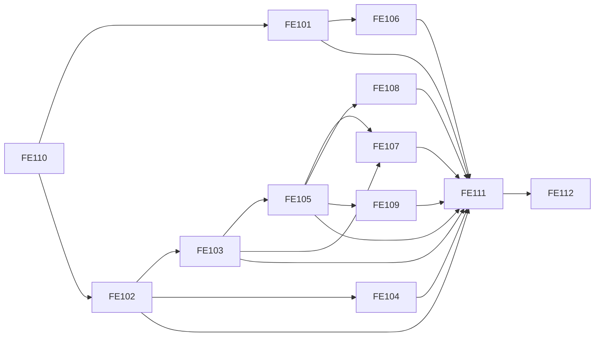

# Product V1 Frontend Swimlane Allocation (narrative-studio / narrative-editor)

## 摘要（中文）

本页把 FE-101..FE-112 按仓库分泳道分配，给出并行边界、两周排期与交付闸门，可直接用于 sprint 排班。

## Executive Summary (EN)

This page allocates FE-101..FE-112 into repo swimlanes, defining parallel boundaries, two-week sequencing, and delivery gates.

## Machine-readable Metadata | 机读元数据

```yaml
doc_id: product-v1-frontend-swimlane-allocation
path: product/prototype/v1-frontend-swimlane-allocation.md
lang_primary: zh-CN
lang_secondary: en
audience: [product, frontend, qa, ai-agent]
agent_ready: true
source_of_truth: narrative-docs
```

## 分配原则

- narrative-editor 优先承接文本域与证据定位链路（TextPane、锚点、修复流）。
- narrative-studio 优先承接驾驶舱工作台与跨视图编排（Workspace shell、Atlas、Export、Telemetry）。
- 契约适配层先行，所有页面工单依赖统一 view model。
- 每周必须保留 20% 容量处理联调与失败路径。

## 泳道分配总览

| Ticket | Priority | Primary Repo | Secondary Repo | Rationale |
| --- | --- | --- | --- | --- |
| FE-110 | P0 | narrative-studio | narrative-editor | 先统一契约和状态机，避免双仓字段漂移 |
| FE-101 | P0 | narrative-studio | narrative-editor | 导入与首屏反馈属于工作台入口 |
| FE-102 | P0 | narrative-studio | narrative-editor | 三栏编排和全局状态协调在工作台层 |
| FE-103 | P0 | narrative-editor | narrative-studio | sentence_ref 定位与原文滚动是编辑器核心 |
| FE-104 | P0 | narrative-studio | narrative-atlas | Atlas 四层视图属于可视主舞台 |
| FE-105 | P0 | narrative-studio | narrative-editor | Insight 右栏在工作台，回跳依赖编辑器锚点 |
| FE-106 | P0 | narrative-studio | narrative-editor | 降级展示和动作编排在工作台 |
| FE-107 | P0 | narrative-editor | narrative-studio | 锚点修复和近邻替换偏编辑器链路 |
| FE-108 | P1 | narrative-studio | narrative-editor | 导出回放偏工作台导出中心 |
| FE-109 | P1 | narrative-editor | narrative-studio | 校对工作台对文本交互依赖更高 |
| FE-111 | P0 | narrative-studio | narrative-editor | 统一事件接线和回放面板在工作台更合适 |
| FE-112 | P0 | narrative-studio | narrative-editor | 端到端场景 runner 需要跨页面整合 |

## 两周排期（可并行）

### Week 1

#### narrative-studio lane

- D1-D2: FE-110 契约适配层与状态机（必须先完成主干）
- D2-D3: FE-101 Import + Fast Start
- D3-D4: FE-102 三栏容器与状态同步
- D4-D5: FE-111 事件埋点底座（先接 EVT-P1/2/3）

#### narrative-editor lane

- D2-D3: FE-103 sentence_ref 定位与回跳
- D4-D5: FE-107 Evidence Repair 第一版（Retry Anchor）

#### Week 1 Gate

- Gate-W1-01: FE-110 merged，FE-101/102/103 可联调。
- Gate-W1-02: 可跑通导入 -> 证据点击 -> 原文定位最小链路。

### Week 2

#### narrative-studio lane

- D1-D2: FE-104 Atlas 四层视图联动
- D2-D3: FE-105 Insight 结论卡与证据链
- D3-D4: FE-106 Degrade Recovery
- D4-D5: FE-108 Export + Replay
- D5: FE-112 场景验收与回归包汇总

#### narrative-editor lane

- D1-D3: FE-109 Proofreading Workbench（先 P0/P1，再 P2）
- D3-D4: FE-107 第二版（Switch Nearby Evidence + MarkAsIssue）
- D5: 配合 FE-112 完成回归补测

#### Week 2 Gate

- Gate-W2-01: SCN-V1-001..005 主路径跑通。
- Gate-W2-02: SCN-V1-003、SCN-V1-004 恢复路径可演示。
- Gate-W2-03: EVT-P1..EVT-P8 字段完整并可回放。

## 并行边界与接口冻结

- 接口冻结点 FZ-1（Week1 D2 结束）:
  - sentence_ref
  - evidence_type
  - diagnostics[].evidence
  - summary_metrics
- 接口冻结点 FZ-2（Week1 D4 结束）:
  - 降级 reason_code
  - export replay_result
  - EvidenceBroken 状态枚举

## 依赖图（简版）



## RACI（最小版）

| Area | Responsible | Accountable | Consulted | Informed |
| --- | --- | --- | --- | --- |
| 契约与状态机 | studio FE lead | product FE owner | editor FE lead | QA |
| 原文定位与修复 | editor FE lead | product FE owner | studio FE lead | QA |
| Atlas 与 Insight 联动 | studio FE lead | product FE owner | atlas FE | editor FE |
| 校对工作台 | editor FE lead | product FE owner | studio FE lead | QA |
| 事件与回归 | studio FE lead | QA lead | editor FE lead | product |

## 可直接粘贴的 Sprint 分配清单

### narrative-studio

- FE-110
- FE-101
- FE-102
- FE-104
- FE-105
- FE-106
- FE-108
- FE-111
- FE-112

### narrative-editor

- FE-103
- FE-107
- FE-109

## 风险与缓解

- 风险: 双仓同时改契约导致联调失败。
  - 缓解: FE-110 单点 owner，所有字段变更通过适配层 PR。
- 风险: FE-105 与 FE-103 互相等待。
  - 缓解: 先提供 mock sentence_ref locator adapter。
- 风险: Week2 后期回归挤压。
  - 缓解: 每日留 20% 缓冲，D4 前冻结新功能。

## 完成定义（Swimlane 版）

- studio lane 完成标准:
  - 工作台编排、Atlas、Insight、Degrade、Export、Telemetry 可演示。
- editor lane 完成标准:
  - sentence_ref 精确定位、修复流、proofreading 工作台可演示。
- 集成完成标准:
  - SCN-V1-001..005 + Gate-00..07 全通过或有已批准豁免记录。
